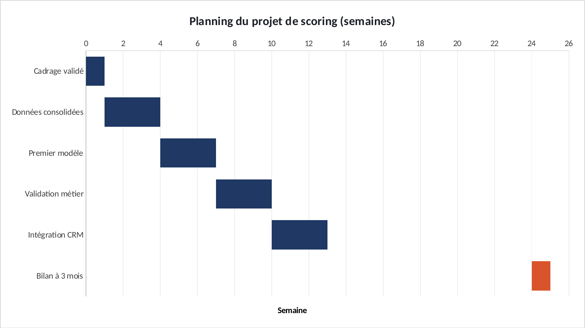

# Tuto : Note de cadrage : le planning en diagramme de Gantt

Refaire tous les graphiques de l'étude dans Excel, étape par étape. Durée : 20 min.

**Les fichiers**

- [`excel/cadrage-gantt-exercice.xlsx`](excel/cadrage-gantt-exercice.xlsx) : les données, rien n'est fait. C'est celui-là qu'on remplit.
- [`excel/cadrage-gantt-corrige.xlsx`](excel/cadrage-gantt-corrige.xlsx) : la version finie, celle des graphiques du site.
- [`excel/csv/`](excel/csv) : les mêmes données en CSV, pour Power BI.
- [`excel/graphiques/`](excel/graphiques) : les graphiques exportés depuis le corrigé.

Le projet d'origine : https://github.com/ATEYABA-K/note-cadrage-scoring-ia-pme

**Ce que vous allez pratiquer** : diagramme de Gantt dans Excel · barres empilées · série invisible · axe en ordre inverse.

## Avant de commencer

- Téléchargez le fichier **exercice** et ouvrez-le dans Excel. Les cellules **jaunes** sont à remplir, les graphiques sont à construire.
- Le fichier **corrigé** contient la version finie : c'est de là que viennent les graphiques du site. Ouvrez-le à côté pour comparer.
- Les formules sont écrites pour Excel en français : les arguments sont séparés par `;`. En anglais, remplacez `;` par `,` et utilisez le nom entre parenthèses.
- Recopier une formule vers le bas : sélectionnez la cellule, puis double-cliquez sur le petit carré en bas à droite.

> Les couleurs du portfolio : bleu `#1F3864`, orange `#D9542B`, gris `#8FA0C2`. Pour les appliquer : clic droit sur une série → **Mettre en forme une série de données** → pot de peinture **Remplissage et trait** → **Remplissage uni** → **Couleur** → **Autres couleurs** → onglet **Personnalisées** → champ **Hex**.

## Étape 1 : Le diagramme de Gantt

*Onglet : Jalons.* Excel n'a pas de bouton « Gantt ». L'astuce : des barres empilées, dont la première (la semaine de début) est rendue invisible.

### 1.1 La durée

- En **D5**, recopiez jusqu'à **D10**. Le +1 compte la semaine de fin.

| Cellule | Formule (Excel en français) | En anglais |
|---|---|---|
| D5 | `=C5-B5+1` | calcul simple |

### 1.2 Les barres

- Sélectionnez **A4:B10**, Ctrl, **D4:D10** → **Insertion** → **Barres empilées**.

### 1.3 L'astuce

- Clic sur la série « Semaine de début » → **Remplissage** → **Aucun remplissage**. Elle disparaît, les durées flottent au bon endroit.
- Axe des jalons : **Catégories en ordre inverse**. Axe des semaines : minimum 0, maximum 26, unité principale 2.
- Le bilan à 3 mois en orange : c'est le jalon isolé, loin après les autres.

**Vérifiez :** « Données consolidées » dure **3** semaines (S1 à S3). Le projet s'étale de S0 à S24.

## Exporter un graphique

- Cliquez sur le bord du graphique pour le sélectionner, puis clic droit → **Enregistrer en tant qu'image…** → format **PNG**.
- Pour une diapo : clic droit → **Copier**, puis **Collage spécial → Image** dans PowerPoint.

## La même chose dans Power BI

**Accueil** → **Obtenir des données** → **Texte/CSV** → choisissez le fichier → vérifiez que le délimiteur est **Point-virgule** → **Charger**.

| Fichier | Visuel | Champs |
|---|---|---|
| `jalons.csv` | Graphique à barres empilées | Axe Y : `jalon` · Axe X : `semaine_debut` (transparent) puis une mesure durée |

Si les décimales s'affichent mal : **Transformer les données** → sélectionnez la colonne → **Type de données** → **Nombre décimal** → **Utilisation des paramètres régionaux** → Anglais (États-Unis).
