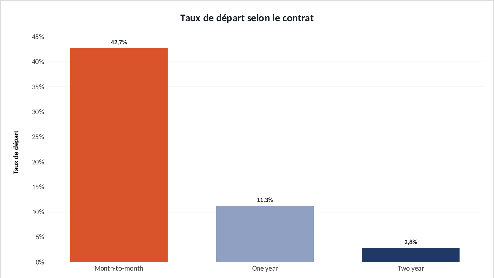
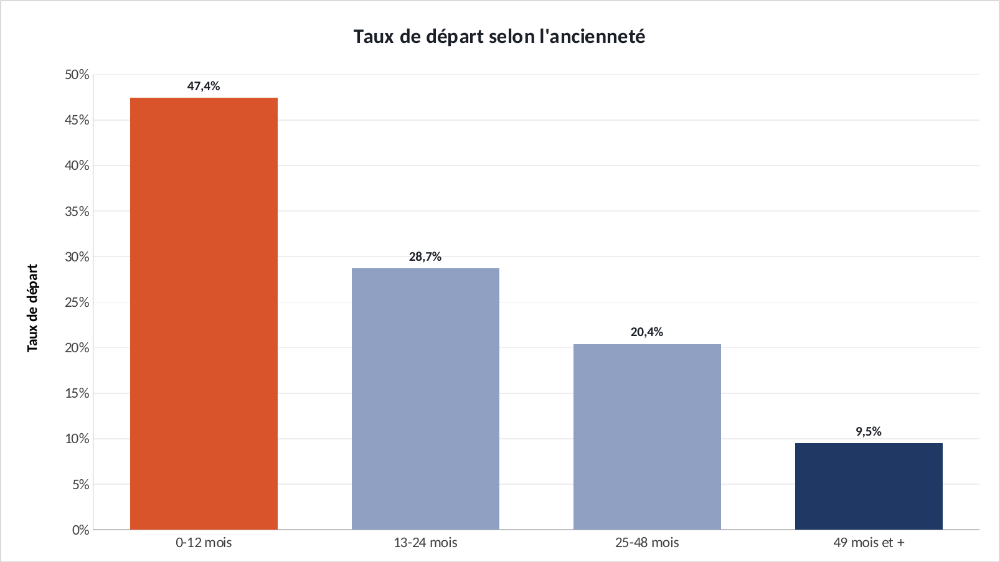
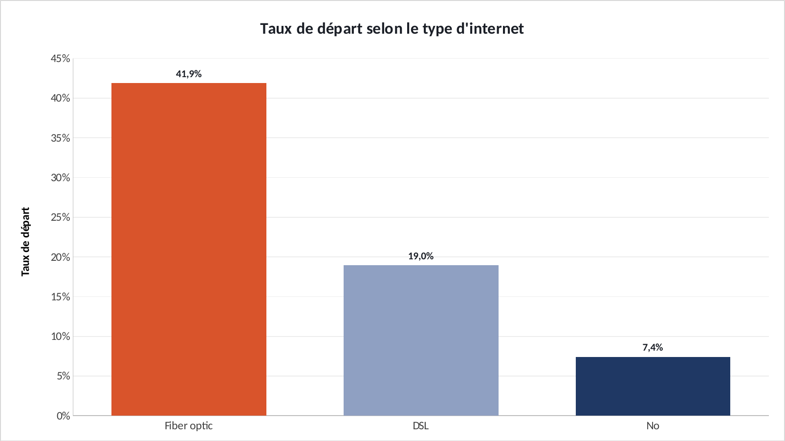

# Tuto : Où se concentre le risque de départ client ?

Refaire tous les graphiques de l'étude dans Excel, étape par étape. Durée : 45 min.

**Les fichiers**

- [`excel/churn-telco-exercice.xlsx`](excel/churn-telco-exercice.xlsx) : les données, rien n'est fait. C'est celui-là qu'on remplit.
- [`excel/churn-telco-corrige.xlsx`](excel/churn-telco-corrige.xlsx) : la version finie, celle des graphiques du site.
- [`excel/csv/`](excel/csv) : les mêmes données en CSV, pour Power BI.
- [`excel/graphiques/`](excel/graphiques) : les graphiques exportés depuis le corrigé.

Le projet d'origine : https://github.com/ATEYABA-K/analyse-churn-telco

**Ce que vous allez pratiquer** : SI imbriqués · tableau croisé dynamique · NB.SI et NB.SI.ENS · histogramme avec étiquettes.

## Avant de commencer

- Téléchargez le fichier **exercice** et ouvrez-le dans Excel. Les cellules **jaunes** sont à remplir, les graphiques sont à construire.
- Le fichier **corrigé** contient la version finie : c'est de là que viennent les graphiques du site. Ouvrez-le à côté pour comparer.
- Les formules sont écrites pour Excel en français : les arguments sont séparés par `;`. En anglais, remplacez `;` par `,` et utilisez le nom entre parenthèses.
- Recopier une formule vers le bas : sélectionnez la cellule, puis double-cliquez sur le petit carré en bas à droite.

> Les couleurs du portfolio : bleu `#1F3864`, orange `#D9542B`, gris `#8FA0C2`. Pour les appliquer : clic droit sur une série → **Mettre en forme une série de données** → pot de peinture **Remplissage et trait** → **Remplissage uni** → **Couleur** → **Autres couleurs** → onglet **Personnalisées** → champ **Hex**.

## Étape 1 : Classer les clients par ancienneté

*Onglet : Clients.* 7 043 clients. On range chacun dans une tranche d'ancienneté pour pouvoir comparer.

### 1.1 La tranche

- En **F5**, puis double-clic sur la poignée : Excel recopie jusqu'à la ligne 7047.

| Cellule | Formule (Excel en français) | En anglais |
|---|---|---|
| F5 | `=SI(B5<=12;"0-12 mois";SI(B5<=24;"13-24 mois";SI(B5<=48;"25-48 mois";"49 mois et +")))` | IF |

**Vérifiez :** Le client de la ligne 5 (ancienneté 1 mois) est en « 0-12 mois ».

## Étape 2 : Calculer les taux de départ

*Onglet : Analyse.* Deux méthodes, au choix. La première est la plus rapide, la seconde se met à jour toute seule.

### 2.1 Méthode rapide : le tableau croisé dynamique

- Onglet **Clients** : cliquez dans le tableau → **Insertion** → **Tableau croisé dynamique** → **Nouvelle feuille de calcul**.
- Glissez **Contrat** dans **Lignes**, **Churn** dans **Colonnes**, **Client** dans **Valeurs** (Excel compte les clients).
- Clic droit sur un nombre → **Afficher les valeurs** → **% du total de la ligne**. La colonne « Yes » donne le taux de départ.

### 2.2 Méthode formules (celle du corrigé)

- Onglet **Analyse**, tableau du contrat (lignes 5 à 7). Recopiez vers le bas.
- Même chose pour l'ancienneté (lignes 11 à 14, colonne **F** des clients) et l'internet (lignes 18 à 20, colonne **C**).

| Cellule | Formule (Excel en français) | En anglais |
|---|---|---|
| B5 | `=NB.SI(Clients!$D$5:$D$7047;A5)` | COUNTIF |
| C5 | `=NB.SI.ENS(Clients!$D$5:$D$7047;A5;Clients!$E$5:$E$7047;"Yes")` | COUNTIFS |
| D5 | `=C5/B5` | calcul simple |
| D23 | `=NB.SI(Clients!$E$5:$E$7047;"Yes")/NBVAL(Clients!$E$5:$E$7047)` | COUNTA |

**Vérifiez :** Mensuel **42,7 %**, 1 an **11,3 %**, 2 ans **2,8 %** : 15 fois plus de départs sans engagement. Global : **26,5 %**.

## Étape 3 : Les trois graphiques

*Onglet : Analyse.* Un histogramme par segment, avec le taux affiché sur chaque barre.

### 3.1 Le graphique

- Sélectionnez **A4:A7**, maintenez **Ctrl**, sélectionnez **D4:D7** → **Insertion** → **Histogramme groupé**.
- Bouton **+** → **Étiquettes de données**. Supprimez la légende. Barre la plus risquée en orange (clic, puis deuxième clic sur la barre).
- Recommencez avec **A10:A14 + D10:D14** (ancienneté) et **A17:A20 + D17:D20** (internet).

**Vérifiez :** Ancienneté : de **47,4 %** la première année à **9,5 %** au-delà de 4 ans. Fibre : **41,9 %**.

## Exporter un graphique

- Cliquez sur le bord du graphique pour le sélectionner, puis clic droit → **Enregistrer en tant qu'image…** → format **PNG**.
- Pour une diapo : clic droit → **Copier**, puis **Collage spécial → Image** dans PowerPoint.

## La même chose dans Power BI

**Accueil** → **Obtenir des données** → **Texte/CSV** → choisissez le fichier → vérifiez que le délimiteur est **Point-virgule** → **Charger**.

| Fichier | Visuel | Champs |
|---|---|---|
| `clients.csv` | Histogramme groupé | Axe X : `contrat` · Valeurs : `client` (Nombre) · Légende : `churn`, puis « Afficher en % du total de la catégorie » |

Si les décimales s'affichent mal : **Transformer les données** → sélectionnez la colonne → **Type de données** → **Nombre décimal** → **Utilisation des paramètres régionaux** → Anglais (États-Unis).
