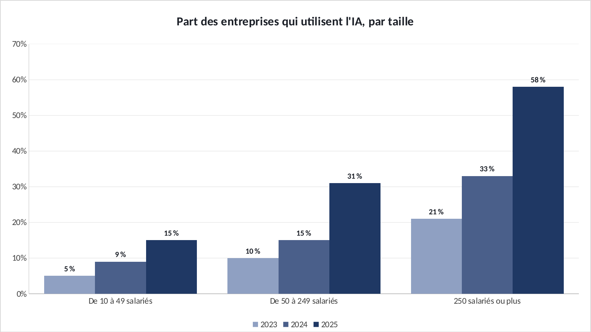

# Tuto : Adoption de l'IA par les entreprises françaises

Refaire tous les graphiques de l'étude dans Excel, étape par étape. Durée : 20 min.

**Les fichiers**

- [`excel/ia-pme-exercice.xlsx`](excel/ia-pme-exercice.xlsx) : les données, rien n'est fait. C'est celui-là qu'on remplit.
- [`excel/ia-pme-corrige.xlsx`](excel/ia-pme-corrige.xlsx) : la version finie, celle des graphiques du site.
- [`excel/csv/`](excel/csv) : les mêmes données en CSV, pour Power BI.
- [`excel/graphiques/`](excel/graphiques) : les graphiques exportés depuis le corrigé.

Le projet d'origine : https://github.com/ATEYABA-K/adoption-ia-pme-france

**Ce que vous allez pratiquer** : histogramme groupé à plusieurs séries · calcul d'écart en points · Looker Studio (gratuit).

## Avant de commencer

- Téléchargez le fichier **exercice** et ouvrez-le dans Excel. Les cellules **jaunes** sont à remplir, les graphiques sont à construire.
- Le fichier **corrigé** contient la version finie : c'est de là que viennent les graphiques du site. Ouvrez-le à côté pour comparer.
- Les formules sont écrites pour Excel en français : les arguments sont séparés par `;`. En anglais, remplacez `;` par `,` et utilisez le nom entre parenthèses.
- Recopier une formule vers le bas : sélectionnez la cellule, puis double-cliquez sur le petit carré en bas à droite.

> Les couleurs du portfolio : bleu `#1F3864`, orange `#D9542B`, gris `#8FA0C2`. Pour les appliquer : clic droit sur une série → **Mettre en forme une série de données** → pot de peinture **Remplissage et trait** → **Remplissage uni** → **Couleur** → **Autres couleurs** → onglet **Personnalisées** → champ **Hex**.

## Étape 1 : L'écart entre grandes et petites entreprises

*Onglet : Donnees.* Les PME rattrapent-elles les grands groupes ? On mesure l'écart en points de pourcentage.

### 1.1 L'écart

- En **B9**, recopiez vers C9 et D9.

| Cellule | Formule (Excel en français) | En anglais |
|---|---|---|
| B9 | `=(B7-B5)*100` | calcul simple |

### 1.2 Le graphique

- Sélectionnez **A4:D7** → **Insertion** → **Histogramme groupé**. Excel fait une série par année.
- Couleurs du plus clair (2023) au plus foncé (2025). Étiquettes de données.

**Vérifiez :** Écart : **16** points en 2023, **24** en 2024, **43** en 2025. Il se creuse.

## Étape 2 : Le même graphique dans Looker Studio

*Onglet : csv/adoption_ia.csv.* Looker Studio est gratuit avec un compte Google. C'est l'outil du tableau de bord d'origine de ce projet.

### 2.1 En ligne

- lookerstudio.google.com → **Créer** → **Rapport** → **Importer un fichier** → `adoption_ia.csv`.
- **Ajouter un graphique** → **Histogramme**. Dimension : `taille`. Dimension de répartition : `annee`. Métrique : `part` (format %).
- Le tableau de bord d'origine : datastudio.google.com/reporting/80b607fa-71f1-461c-b5ae-30e91c213f86

**Vérifiez :** Le même histogramme qu'Excel, partageable par un simple lien.

## Exporter un graphique

- Cliquez sur le bord du graphique pour le sélectionner, puis clic droit → **Enregistrer en tant qu'image…** → format **PNG**.
- Pour une diapo : clic droit → **Copier**, puis **Collage spécial → Image** dans PowerPoint.

## La même chose dans Power BI

**Accueil** → **Obtenir des données** → **Texte/CSV** → choisissez le fichier → vérifiez que le délimiteur est **Point-virgule** → **Charger**.

| Fichier | Visuel | Champs |
|---|---|---|
| `adoption_ia.csv` | Histogramme groupé | Axe X : `taille` · Légende : `annee` · Axe Y : `part` |

Si les décimales s'affichent mal : **Transformer les données** → sélectionnez la colonne → **Type de données** → **Nombre décimal** → **Utilisation des paramètres régionaux** → Anglais (États-Unis).
