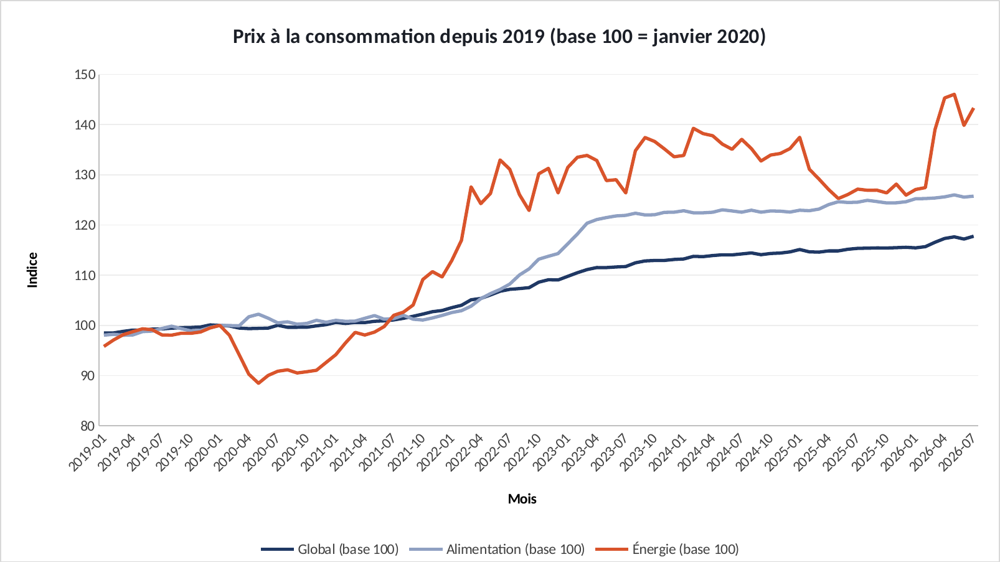
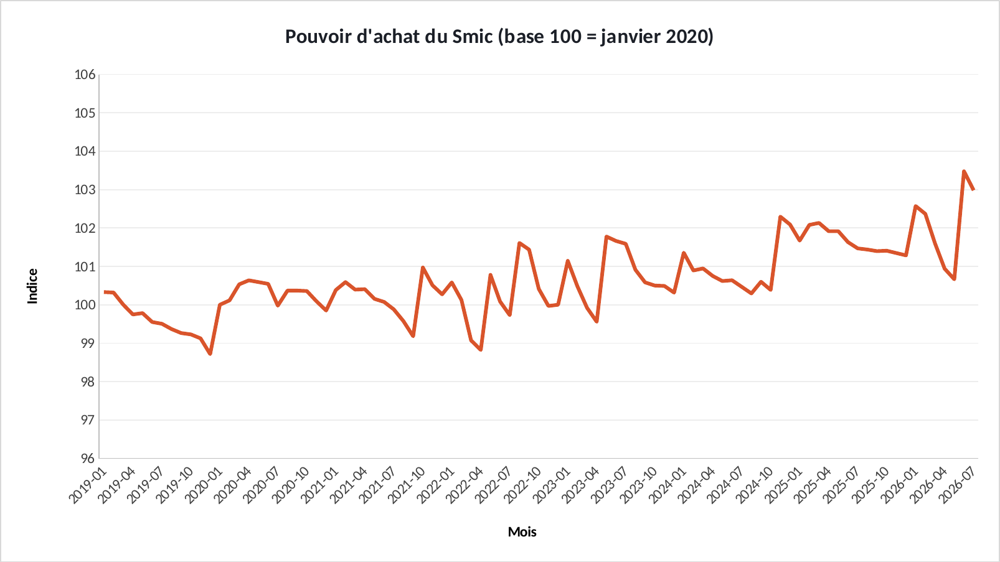

# Tuto : Évolution des prix à la consommation en France

Refaire tous les graphiques de l'étude dans Excel, étape par étape. Durée : 40 min.

**Les fichiers**

- [`excel/ipc-france-exercice.xlsx`](excel/ipc-france-exercice.xlsx) : les données, rien n'est fait. C'est celui-là qu'on remplit.
- [`excel/ipc-france-corrige.xlsx`](excel/ipc-france-corrige.xlsx) : la version finie, celle des graphiques du site.
- [`excel/csv/`](excel/csv) : les mêmes données en CSV, pour Power BI.
- [`excel/graphiques/`](excel/graphiques) : les graphiques exportés depuis le corrigé.

Le projet d'origine : https://github.com/ATEYABA-K/analyse-ipc-france-covid

**Ce que vous allez pratiquer** : rebaser une série à 100 · référence mixte (B$17) · déflater un salaire · courbes sur 91 mois.

## Avant de commencer

- Téléchargez le fichier **exercice** et ouvrez-le dans Excel. Les cellules **jaunes** sont à remplir, les graphiques sont à construire.
- Le fichier **corrigé** contient la version finie : c'est de là que viennent les graphiques du site. Ouvrez-le à côté pour comparer.
- Les formules sont écrites pour Excel en français : les arguments sont séparés par `;`. En anglais, remplacez `;` par `,` et utilisez le nom entre parenthèses.
- Recopier une formule vers le bas : sélectionnez la cellule, puis double-cliquez sur le petit carré en bas à droite.

> Les couleurs du portfolio : bleu `#1F3864`, orange `#D9542B`, gris `#8FA0C2`. Pour les appliquer : clic droit sur une série → **Mettre en forme une série de données** → pot de peinture **Remplissage et trait** → **Remplissage uni** → **Couleur** → **Autres couleurs** → onglet **Personnalisées** → champ **Hex**.

## Étape 1 : Rebaser les prix à 100 en janvier 2020

*Onglet : Donnees.* Les indices n'ont pas le même point de départ. On les ramène tous à 100 en janvier 2020 (ligne 17, en bleu clair) pour comparer leur évolution.

### 1.1 La formule

- En **F5**. Le `$` devant 17 bloque la ligne de janvier 2020, mais laisse la colonne libre.
- Recopiez vers la droite jusqu'à **H5** (alimentation, énergie), puis tout vers le bas jusqu'à la ligne 95.

| Cellule | Formule (Excel en français) | En anglais |
|---|---|---|
| F5 | `=B5/B$17*100` | — |

### 1.2 Le graphique

- **A4:A95** + **F4:H95** (Ctrl) → **Courbes**. Axe vertical : minimum 80.

**✅ Vérifiez :** Ligne 17 : les trois valent **100**. En juillet 2026 : global **117,8**, alimentation **125,7**, énergie **143,3**.

## Étape 2 : Le Smic a-t-il suivi les prix ?

*Onglet : Donnees.* Pouvoir d'achat = évolution du Smic divisée par évolution des prix. Au-dessus de 100, le Smic a gagné sur les prix.

### 2.1 La formule

- En **I5**, recopiez jusqu'à la ligne 95.

| Cellule | Formule (Excel en français) | En anglais |
|---|---|---|
| I5 | `=(E5/E$17)/(B5/B$17)*100` | — |

### 2.2 Le graphique

- **A4:A95** + **I4:I95** → **Courbes**. Axe vertical : de 96 à 106.

**✅ Vérifiez :** De **100,3** en janvier 2019 à **103,0** en juillet 2026 : le Smic a un peu gagné sur les prix.

## Exporter un graphique

- Cliquez sur le bord du graphique pour le sélectionner, puis clic droit → **Enregistrer en tant qu'image…** → format **PNG**.
- Pour une diapo : clic droit → **Copier**, puis **Collage spécial → Image** dans PowerPoint.

## La même chose dans Power BI

**Accueil** → **Obtenir des données** → **Texte/CSV** → choisissez le fichier → vérifiez que le délimiteur est **Point-virgule** → **Charger**.

| Fichier | Visuel | Champs |
|---|---|---|
| `ipc_smic.csv` | Graphique en courbes | Axe X : `mois` · Axe Y : `ipc_global`, `ipc_alimentation`, `ipc_energie` (rebaser avec une mesure DAX) |

Si les décimales s'affichent mal : **Transformer les données** → sélectionnez la colonne → **Type de données** → **Nombre décimal** → **Utilisation des paramètres régionaux** → Anglais (États-Unis).
