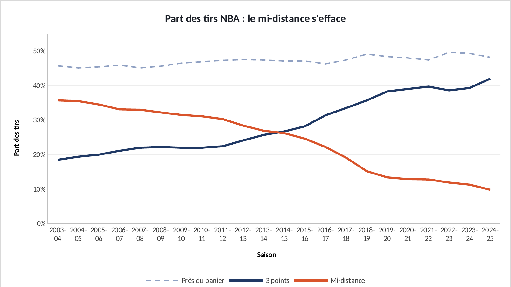
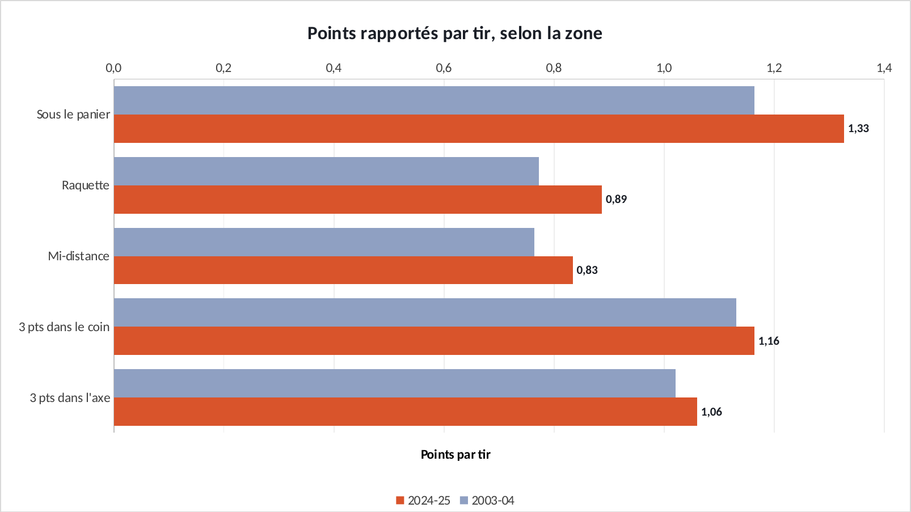
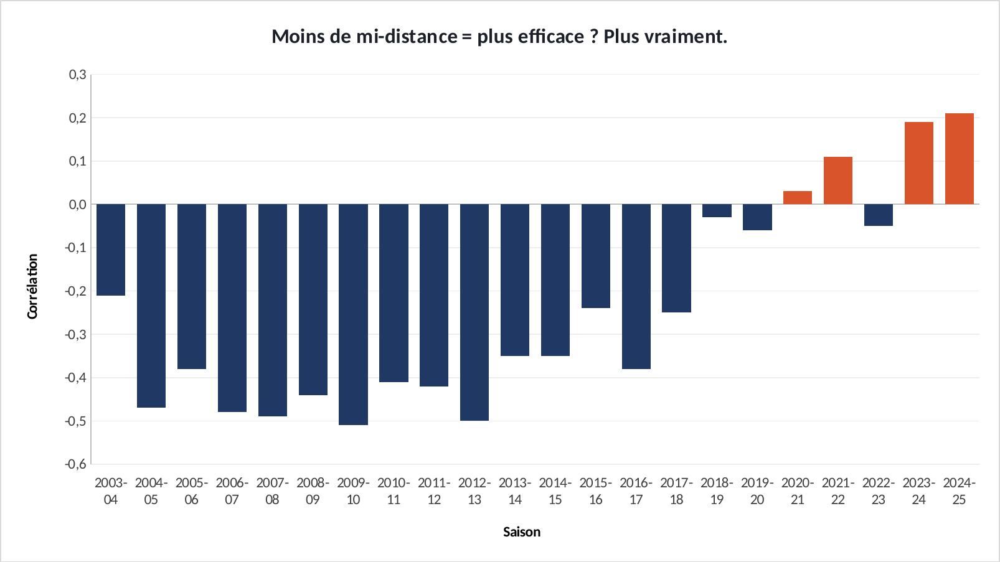
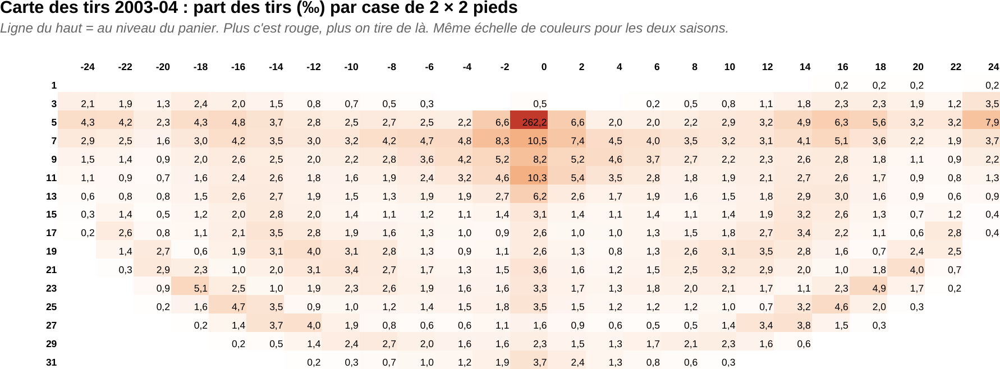
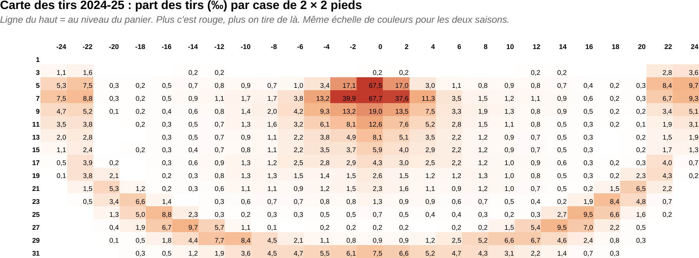

# Tuto : Le tir que la NBA a arrêté de financer

Refaire tous les graphiques de l'étude dans Excel, étape par étape. Durée : 1 h environ.

**Les fichiers**

- [`excel/nba-mi-distance-exercice.xlsx`](excel/nba-mi-distance-exercice.xlsx) : les données, rien n'est fait. C'est celui-là qu'on remplit.
- [`excel/nba-mi-distance-corrige.xlsx`](excel/nba-mi-distance-corrige.xlsx) : la version finie, celle des graphiques du site.
- [`excel/csv/`](excel/csv) : les mêmes données en CSV, pour Power BI.
- [`excel/graphiques/`](excel/graphiques) : les graphiques exportés depuis le corrigé.

**Ce que vous allez pratiquer** : additionner des colonnes · graphique en courbes à plusieurs séries · barres horizontales comparées · SOMMEPROD : la décomposition mix / performance · « Inverser si négatif » pour colorer les barres · carte de chaleur avec la mise en forme conditionnelle · Power BI : import CSV.

## Avant de commencer

- Téléchargez le fichier **exercice** et ouvrez-le dans Excel. Les cellules **jaunes** sont à remplir, les graphiques sont à construire.
- Le fichier **corrigé** contient la version finie : c'est de là que viennent les graphiques du site. Ouvrez-le à côté pour comparer.
- Les formules sont écrites pour Excel en français : les arguments sont séparés par `;`. En anglais, remplacez `;` par `,` et utilisez le nom entre parenthèses.
- Recopier une formule vers le bas : sélectionnez la cellule, puis double-cliquez sur le petit carré en bas à droite.

> Les couleurs du portfolio : bleu `#1F3864`, orange `#D9542B`, gris `#8FA0C2`. Pour les appliquer : clic droit sur une série → **Mettre en forme une série de données** → pot de peinture **Remplissage et trait** → **Remplissage uni** → **Couleur** → **Autres couleurs** → onglet **Personnalisées** → champ **Hex**.

## Étape 1 : Le budget change de canal

*Onglet : Parts.* Regrouper les 5 zones en 3 grandes zones, puis tracer leur évolution sur 22 saisons.

### 1.1 Les grandes zones

- En **G5**, **H5** et **I5**, puis recopiez les trois jusqu'à la ligne **26**.

| Cellule | Formule (Excel en français) | En anglais |
|---|---|---|
| G5 | `=B5+C5` | — |
| H5 | `=E5+F5` | — |
| I5 | `=D5` | — |

### 1.2 Le graphique

- Sélectionnez **A4:A26**, maintenez **Ctrl** et sélectionnez **G4:I26**.
- **Insertion** → **Courbes**. Couleurs : « Près du panier » en gris pointillé, « 3 points » en bleu, « Mi-distance » en orange, épaisseur 2,75 pt.
- Axe vertical : Minimum 0, Maximum 0,55, format %.

**✅ Vérifiez :** Les courbes orange et bleue se croisent en 2014-15. Le mi-distance finit à **9,8 %**.

## Étape 2 : Cinq canaux, cinq rendements

*Onglet : Rendement.* Comparer le rendement de chaque zone entre la première et la dernière saison.

### 2.1 Le petit tableau

- En **H4:J9** : une ligne par zone, la première saison (ligne 5) et la dernière (ligne 26).
- Même logique pour chaque zone, en changeant de colonne : Raquette = colonne C, Mi-distance = D, coin = E, axe = F.

| Cellule | Formule (Excel en français) | En anglais |
|---|---|---|
| I5 | `=B5` | — |
| J5 | `=B26` | — |
| I6 | `=C5` | — |
| J6 | `=C26` | — |

### 2.2 Le graphique

- Sélectionnez **H4:J9** → **Insertion** → **Barres groupées**.
- Clic droit sur l'axe des zones → **Mettre en forme l'axe** → cochez **Catégories en ordre inverse**.
- 2003-04 en gris, 2024-25 en orange. Sur la série orange : bouton **+** → **Étiquettes de données**.

**✅ Vérifiez :** Mi-distance : **0,83** point par tir, contre **1,16** pour le 3 points dans le coin.

## Étape 3 : Mieux tirer, ou tirer au bon endroit ?

*Onglet : Decomposition.* Séparer deux effets : les joueurs sont plus adroits (effet adresse), ou ils tirent depuis de meilleures zones (effet mix). C'est la même méthode qu'en analyse de mix marketing.

### 3.1 Rapatrier les chiffres

- Ligne 5 (Sous le panier) : parts et rendements de la première et de la dernière saison.
- Lignes 6 à 9 : même chose en décalant d'une colonne (C, D, E, F).

| Cellule | Formule (Excel en français) | En anglais |
|---|---|---|
| B5 | `=Parts!B5` | — |
| C5 | `=Parts!B26` | — |
| D5 | `=Rendement!B5` | — |
| E5 | `=Rendement!B26` | — |

### 3.2 SOMMEPROD

- SOMMEPROD multiplie deux colonnes ligne par ligne, puis additionne. Part × rendement, zone par zone = rendement global.

| Cellule | Formule (Excel en français) | En anglais |
|---|---|---|
| B12 | `=SOMMEPROD(B5:B9;D5:D9)` | SUMPRODUCT |
| B13 | `=SOMMEPROD(C5:C9;E5:E9)` | — |
| B14 | `=B13-B12` | — |

### 3.3 Les trois effets

- Effet mix : nouvelle répartition, ancienne adresse. Effet adresse : ancienne répartition, nouvelle adresse.

| Cellule | Formule (Excel en français) | En anglais |
|---|---|---|
| B15 | `=SOMMEPROD(C5:C9-B5:B9;D5:D9)` | — |
| B16 | `=SOMMEPROD(B5:B9;E5:E9-D5:D9)` | — |
| B17 | `=SOMMEPROD(C5:C9-B5:B9;E5:E9-D5:D9)` | — |
| B18 | `=B15/B14` | — |
| B19 | `=ARRONDI(B15+B16+B17-B14;10)` | ROUND |

**✅ Vérifiez :** B15 (effet mix) ≈ **0,054** et B18 ≈ **37 %**. B19 doit afficher **0** : les trois effets additionnés redonnent la hausse totale.

## Étape 4 : Quand tout le monde quitte un canal

*Onglet : Correlation.* Un histogramme avec les valeurs négatives et positives de couleurs différentes, en une seule manipulation.

### 4.1 Le graphique

- Sélectionnez **A4:B26** → **Insertion** → **Histogramme groupé**. Supprimez la légende.
- Clic droit sur l'axe horizontal → **Mettre en forme l'axe** → **Étiquettes** → Position **Bas**.

### 4.2 « Inverser si négatif »

- Clic droit sur les barres → **Mettre en forme une série de données** → **Remplissage uni**, couleur orange.
- Cochez **Inverser si négatif** : une deuxième couleur apparaît, choisissez le bleu. Les barres sous zéro passent en bleu.

**✅ Vérifiez :** Bleu jusqu'en 2019-20 environ, puis des barres orange : le lien s'inverse.

## Étape 5 : La carte du terrain

*Onglet : Terrain 2004 et Terrain 2025.* Transformer un tableau de chiffres en carte de chaleur : on voit d'où les joueurs tirent.

### 5.1 Mise en forme conditionnelle

- Sélectionnez **B5:Z20**.
- **Accueil** → **Mise en forme conditionnelle** → **Nuances de couleurs** → **Autres règles**.
- Style : **Échelle à trois couleurs**. Minimum : Nombre `0`, blanc. Point milieu : Nombre `10`, `#F4B183`. Maximum : Nombre `40`, `#C0392B`.
- Pourquoi un maximum fixe à 40 et pas « valeur la plus élevée » ? Pour que les deux saisons aient la même échelle de couleurs. Sinon, la comparaison ment.
- Faites pareil sur l'autre onglet, puis comparez les deux : la zone entre la raquette et la ligne à 3 points se vide.

**✅ Vérifiez :** En 2025, les cases rouges sont sous le panier et sur la ligne à 3 points. Presque plus rien entre les deux.

## Exporter un graphique

- Cliquez sur le bord du graphique pour le sélectionner, puis clic droit → **Enregistrer en tant qu'image…** → format **PNG**.
- Pour une diapo : clic droit → **Copier**, puis **Collage spécial → Image** dans PowerPoint.

## La même chose dans Power BI

**Accueil** → **Obtenir des données** → **Texte/CSV** → choisissez le fichier → vérifiez que le délimiteur est **Point-virgule** → **Charger**.

| Fichier | Visuel | Champs |
|---|---|---|
| `parts_par_zone.csv` | Graphique en courbes | Axe X : `saison` · Axe Y : `Mi-distance`, `3 pts dans le coin`, `3 pts dans l'axe` |
| `rendement_par_zone.csv` | Graphique à barres groupées | Filtrez les saisons 2003-04 et 2024-25, puis zones en axe |
| `correlation_equipes.csv` | Histogramme groupé | Axe X : `saison` · Axe Y : `correlation` |
| `terrain.csv` | Nuage de points | Axe X : `x_pieds` · Axe Y : `y_pieds` · Taille : `part_des_tirs` · Axe de lecture : `saison` (le terrain s'anime) |

Si les décimales s'affichent mal : **Transformer les données** → sélectionnez la colonne → **Type de données** → **Nombre décimal** → **Utilisation des paramètres régionaux** → Anglais (États-Unis).
