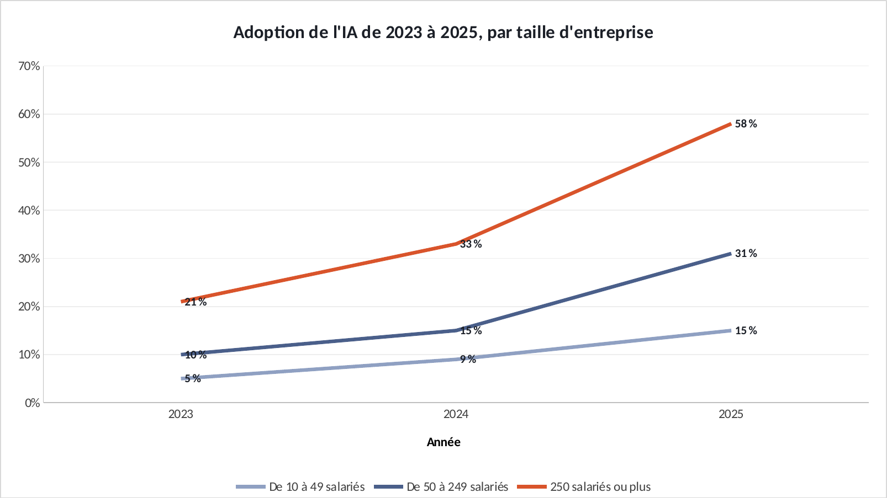

# Tuto : Automatisation d'un reporting Insee

Refaire tous les graphiques de l'étude dans Excel, étape par étape. Durée : 30 min.

**Les fichiers**

- [`excel/reporting-insee-exercice.xlsx`](excel/reporting-insee-exercice.xlsx) : les données, rien n'est fait. C'est celui-là qu'on remplit.
- [`excel/reporting-insee-corrige.xlsx`](excel/reporting-insee-corrige.xlsx) : la version finie, celle des graphiques du site.
- [`excel/csv/`](excel/csv) : les mêmes données en CSV, pour Power BI.
- [`excel/graphiques/`](excel/graphiques) : les graphiques exportés depuis le corrigé.

Le projet d'origine : https://github.com/ATEYABA-K/automatisation-reporting-insee

**Ce que vous allez pratiquer** : courbes avec marqueurs · Power Query : un import qui s'actualise · Actualiser tout.

## Avant de commencer

- Téléchargez le fichier **exercice** et ouvrez-le dans Excel. Les cellules **jaunes** sont à remplir, les graphiques sont à construire.
- Le fichier **corrigé** contient la version finie : c'est de là que viennent les graphiques du site. Ouvrez-le à côté pour comparer.
- Les formules sont écrites pour Excel en français : les arguments sont séparés par `;`. En anglais, remplacez `;` par `,` et utilisez le nom entre parenthèses.
- Recopier une formule vers le bas : sélectionnez la cellule, puis double-cliquez sur le petit carré en bas à droite.

> Les couleurs du portfolio : bleu `#1F3864`, orange `#D9542B`, gris `#8FA0C2`. Pour les appliquer : clic droit sur une série → **Mettre en forme une série de données** → pot de peinture **Remplissage et trait** → **Remplissage uni** → **Couleur** → **Autres couleurs** → onglet **Personnalisées** → champ **Hex**.

## Étape 1 : La progression de 2023 à 2025

*Onglet : Donnees.* Dans le projet, un robot télécharge et nettoie le fichier Insee chaque mois. Ici, on fait le graphique du reporting.

### 1.1 La progression

- En **B9**, recopiez vers C9 et D9.

| Cellule | Formule (Excel en français) | En anglais |
|---|---|---|
| B9 | `=(B7-B5)*100` | calcul simple |

### 1.2 Le graphique

- **A4:D7** → **Insertion** → **Courbes avec marqueurs**. 250+ en orange. Étiquettes de données.

**Vérifiez :** Progression : **+10** points (10-49), **+21** (50-249), **+37** (250 et plus).

## Étape 2 : Automatiser sans coder : Power Query

*Onglet : csv/adoption_ia.csv.* L'équivalent Excel du robot : un import qui se met à jour en un clic quand le fichier change.

### 2.1 L'import

- Classeur vide → **Données** → **À partir d'un fichier texte/CSV** → `adoption_ia.csv` → **Charger**.
- Faites le graphique à partir de ce tableau (étape 1.2).

### 2.2 La mise à jour

- Remplacez le CSV par une version plus récente, même nom, même dossier.
- **Données** → **Actualiser tout** : le tableau et le graphique se mettent à jour seuls.

**Vérifiez :** Modifiez une valeur dans le CSV, actualisez : le graphique bouge sans rien refaire.

## Exporter un graphique

- Cliquez sur le bord du graphique pour le sélectionner, puis clic droit → **Enregistrer en tant qu'image…** → format **PNG**.
- Pour une diapo : clic droit → **Copier**, puis **Collage spécial → Image** dans PowerPoint.

## La même chose dans Power BI

**Accueil** → **Obtenir des données** → **Texte/CSV** → choisissez le fichier → vérifiez que le délimiteur est **Point-virgule** → **Charger**.

| Fichier | Visuel | Champs |
|---|---|---|
| `adoption_ia.csv` | Graphique en courbes | Axe X : `annee` · Légende : `taille` · Axe Y : `part` · puis **Actualiser** quand le fichier change |

Si les décimales s'affichent mal : **Transformer les données** → sélectionnez la colonne → **Type de données** → **Nombre décimal** → **Utilisation des paramètres régionaux** → Anglais (États-Unis).
