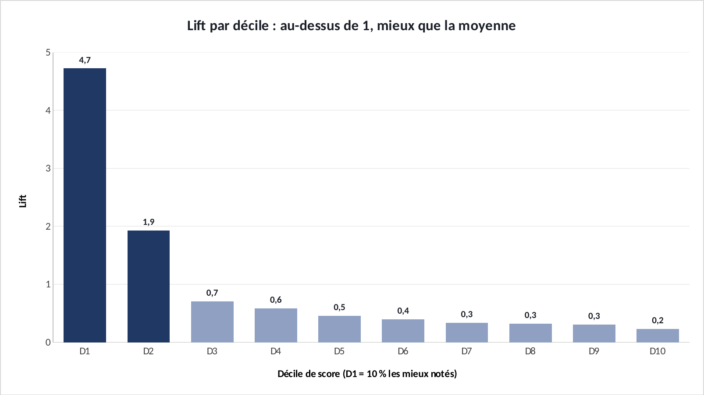

# Tuto : Scoring de propension B2B : qui appeler en premier ?

Refaire tous les graphiques de l'étude dans Excel, étape par étape. Durée : 20 min.

**Les fichiers**

- [`excel/scoring-b2b-exercice.xlsx`](excel/scoring-b2b-exercice.xlsx) : les données, rien n'est fait. C'est celui-là qu'on remplit.
- [`excel/scoring-b2b-corrige.xlsx`](excel/scoring-b2b-corrige.xlsx) : la version finie, celle des graphiques du site.
- [`excel/csv/`](excel/csv) : les mêmes données en CSV, pour Power BI.
- [`excel/graphiques/`](excel/graphiques) : les graphiques exportés depuis le corrigé.

Le projet d'origine : https://github.com/ATEYABA-K/scoring-prospects-b2b

**Ce que vous allez pratiquer** : moyenne pondérée avec SOMMEPROD · référence absolue $ · lire un lift.

## Avant de commencer

- Téléchargez le fichier **exercice** et ouvrez-le dans Excel. Les cellules **jaunes** sont à remplir, les graphiques sont à construire.
- Le fichier **corrigé** contient la version finie : c'est de là que viennent les graphiques du site. Ouvrez-le à côté pour comparer.
- Les formules sont écrites pour Excel en français : les arguments sont séparés par `;`. En anglais, remplacez `;` par `,` et utilisez le nom entre parenthèses.
- Recopier une formule vers le bas : sélectionnez la cellule, puis double-cliquez sur le petit carré en bas à droite.

> Les couleurs du portfolio : bleu `#1F3864`, orange `#D9542B`, gris `#8FA0C2`. Pour les appliquer : clic droit sur une série → **Mettre en forme une série de données** → pot de peinture **Remplissage et trait** → **Remplissage uni** → **Couleur** → **Autres couleurs** → onglet **Personnalisées** → champ **Hex**.

## Étape 1 : Le lift par décile

*Onglet : Deciles.* Le modèle (en Python, dans le dépôt) a classé les prospects en 10 groupes. Le lift dit combien de fois chaque groupe convertit mieux que la moyenne.

### 1.1 Le taux moyen

- Moyenne pondérée par le nombre de prospects de chaque décile :

| Cellule | Formule (Excel en français) | En anglais |
|---|---|---|
| E2 | `=SOMMEPROD(B5:B14;C5:C14)/SOMME(C5:C14)` | SUMPRODUCT |

### 1.2 Le lift

- En **D5**, puis recopiez jusqu'à **D14**.

| Cellule | Formule (Excel en français) | En anglais |
|---|---|---|
| D5 | `=B5/$E$2` | — |

### 1.3 Le graphique

- **A4:A14** + **D4:D14** (Ctrl) → **Histogramme groupé**. D1 et D2 en bleu (au-dessus de 1), le reste en gris. Étiquettes de données.

**✅ Vérifiez :** Taux moyen **11,3 %**. D1 : lift **4,7** (les 10 % les mieux notés convertissent 4,7 fois plus). Dès D3, on passe sous 1.

## Exporter un graphique

- Cliquez sur le bord du graphique pour le sélectionner, puis clic droit → **Enregistrer en tant qu'image…** → format **PNG**.
- Pour une diapo : clic droit → **Copier**, puis **Collage spécial → Image** dans PowerPoint.

## La même chose dans Power BI

**Accueil** → **Obtenir des données** → **Texte/CSV** → choisissez le fichier → vérifiez que le délimiteur est **Point-virgule** → **Charger**.

| Fichier | Visuel | Champs |
|---|---|---|
| `deciles.csv` | Histogramme groupé | Axe X : `decile` · Axe Y : mesure DAX `Lift = AVERAGE(deciles[taux_conversion]) / 0.1127` |

Si les décimales s'affichent mal : **Transformer les données** → sélectionnez la colonne → **Type de données** → **Nombre décimal** → **Utilisation des paramètres régionaux** → Anglais (États-Unis).
