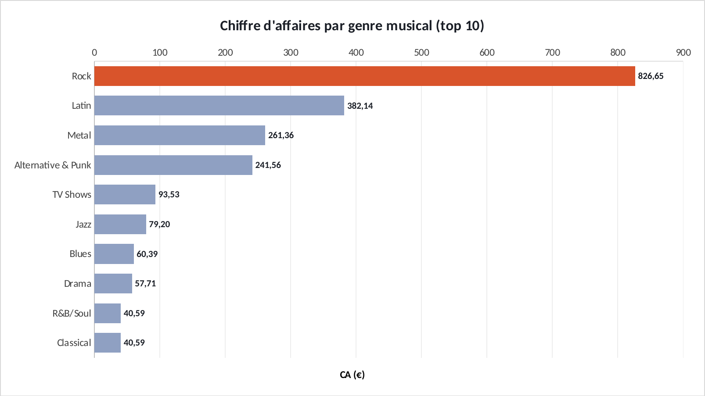
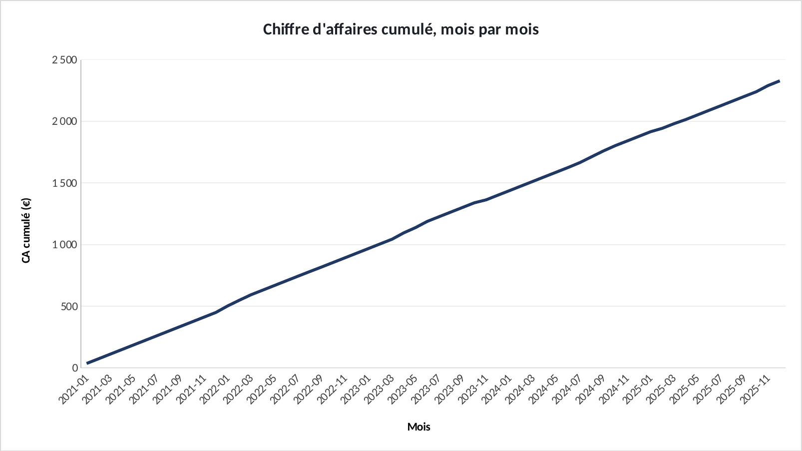
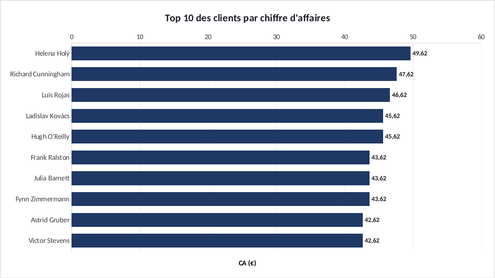

# Tuto : Analyse SQL des ventes d'un magasin de musique

Refaire tous les graphiques de l'étude dans Excel, étape par étape. Durée : 1 h.

**Les fichiers**

- [`excel/sql-musique-exercice.xlsx`](excel/sql-musique-exercice.xlsx) : les données, rien n'est fait. C'est celui-là qu'on remplit.
- [`excel/sql-musique-corrige.xlsx`](excel/sql-musique-corrige.xlsx) : la version finie, celle des graphiques du site.
- [`excel/csv/`](excel/csv) : les mêmes données en CSV, pour Power BI.
- [`excel/graphiques/`](excel/graphiques) : les graphiques exportés depuis le corrigé.

Le projet d'origine : https://github.com/ATEYABA-K/analyse-sql-ventes-musique

**Ce que vous allez pratiquer** : DB Browser for SQLite (gratuit) · jointures, GROUP BY, fonctions fenêtre · coller un résultat SQL dans Excel · barres horizontales · un axe qui part de 0.

## Avant de commencer

- Téléchargez le fichier **exercice** et ouvrez-le dans Excel. Les cellules **jaunes** sont à remplir, les graphiques sont à construire.
- Le fichier **corrigé** contient la version finie : c'est de là que viennent les graphiques du site. Ouvrez-le à côté pour comparer.
- Les formules sont écrites pour Excel en français : les arguments sont séparés par `;`. En anglais, remplacez `;` par `,` et utilisez le nom entre parenthèses.
- Recopier une formule vers le bas : sélectionnez la cellule, puis double-cliquez sur le petit carré en bas à droite.

> Les couleurs du portfolio : bleu `#1F3864`, orange `#D9542B`, gris `#8FA0C2`. Pour les appliquer : clic droit sur une série → **Mettre en forme une série de données** → pot de peinture **Remplissage et trait** → **Remplissage uni** → **Couleur** → **Autres couleurs** → onglet **Personnalisées** → champ **Hex**.

## Étape 1 : Lancer les requêtes SQL

*Onglet : Requetes.* La base est un fichier SQLite. On l'interroge avec un outil gratuit, puis on récupère le résultat dans Excel.

### 1.1 L'outil

- Installez **DB Browser for SQLite** (sqlitebrowser.org, gratuit, Windows et Mac).
- Téléchargez `chinook.db` dans le dépôt GitHub du projet. Dans DB Browser : **Ouvrir une base de données** → `chinook.db`.

### 1.2 Exécuter

- Onglet **Exécuter le SQL** → collez une requête de l'onglet **Requetes** du fichier Excel → **Ctrl + Entrée**.
- Dans le résultat : **Ctrl + A** puis **Ctrl + C**. Dans Excel, cliquez en **A5** de l'onglet correspondant (Genres, Cumul, Clients) → **Ctrl + V**.
- Pour le total du magasin, lancez aussi : `SELECT ROUND(SUM(Total), 2) FROM Invoice;` et collez le résultat en **G2** de l'onglet Genres.

**Vérifiez :** Onglet Genres : 10 lignes, le Rock en premier avec **826,65 €**. Total en G2 : **2 328,60 €**.

## Étape 2 : Le poids du Rock

*Onglet : Genres.* Quelle part du chiffre d'affaires total fait chaque genre ? Le `$` bloque le total quand on recopie.

### 2.1 La part

- En **D5**, puis recopiez jusqu'à **D14**. Format **Pourcentage**.

| Cellule | Formule (Excel en français) | En anglais |
|---|---|---|
| D5 | `=B5/$G$2` | calcul simple |

### 2.2 Le graphique

- Sélectionnez **A4:B14** → **Insertion** → **Barres groupées**.
- Clic droit sur l'axe des genres → **Mettre en forme l'axe** → **Catégories en ordre inverse** (le Rock passe en haut).
- Rock en orange, le reste en gris. Étiquettes de données.

**Vérifiez :** Le Rock pèse **35,5 %** du chiffre d'affaires à lui seul.

## Étape 3 : Le cumul et les meilleurs clients

*Onglet : Cumul et Clients.* Une courbe pour la tendance, des barres pour le classement, et un piège à éviter.

### 3.1 La courbe

- Onglet **Cumul** : sélectionnez **A4:A64**, Ctrl, **C4:C64** → **Insertion** → **Courbes**.

### 3.2 Les clients et le piège de l'axe

- Onglet **Clients** : **A4:A14** + **C4:C14** → **Barres groupées**, catégories en ordre inverse.
- Excel fait partir l'axe à 38 € : les écarts paraissent énormes alors qu'ils sont de quelques euros. Clic droit sur l'axe → **Minimum** = `0`.

**Vérifiez :** Cumul final : **2 328,60 €**. Avec l'axe à 0, on voit que les 10 meilleurs clients pèsent presque pareil (42 à 50 €).

## Exporter un graphique

- Cliquez sur le bord du graphique pour le sélectionner, puis clic droit → **Enregistrer en tant qu'image…** → format **PNG**.
- Pour une diapo : clic droit → **Copier**, puis **Collage spécial → Image** dans PowerPoint.

## La même chose dans Power BI

**Accueil** → **Obtenir des données** → **Texte/CSV** → choisissez le fichier → vérifiez que le délimiteur est **Point-virgule** → **Charger**.

| Fichier | Visuel | Champs |
|---|---|---|
| `genres.csv` | Graphique à barres groupées | Axe Y : `genre` · Axe X : `ca_total` |
| `cumul.csv` | Graphique en courbes | Axe X : `mois` · Axe Y : `ca_cumule` |

Si les décimales s'affichent mal : **Transformer les données** → sélectionnez la colonne → **Type de données** → **Nombre décimal** → **Utilisation des paramètres régionaux** → Anglais (États-Unis).
