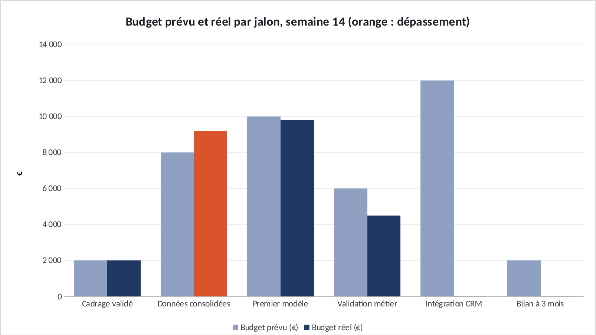

# Tuto : Suivre un projet après l'avoir cadré

Refaire tous les graphiques de l'étude dans Excel, étape par étape. Durée : 30 min.

**Les fichiers**

- [`excel/suivi-projet-exercice.xlsx`](excel/suivi-projet-exercice.xlsx) : les données, rien n'est fait. C'est celui-là qu'on remplit.
- [`excel/suivi-projet-corrige.xlsx`](excel/suivi-projet-corrige.xlsx) : la version finie, celle des graphiques du site.
- [`excel/csv/`](excel/csv) : les mêmes données en CSV, pour Power BI.
- [`excel/graphiques/`](excel/graphiques) : les graphiques exportés depuis le corrigé.

Le projet d'origine : https://github.com/ATEYABA-K/suivi-projet-dashboard-kpi

**Ce que vous allez pratiquer** : SI · NB.SI, NBVAL, SOMME.SI · indicateurs de pilotage · histogramme prévu / réel.

## Avant de commencer

- Téléchargez le fichier **exercice** et ouvrez-le dans Excel. Les cellules **jaunes** sont à remplir, les graphiques sont à construire.
- Le fichier **corrigé** contient la version finie : c'est de là que viennent les graphiques du site. Ouvrez-le à côté pour comparer.
- Les formules sont écrites pour Excel en français : les arguments sont séparés par `;`. En anglais, remplacez `;` par `,` et utilisez le nom entre parenthèses.
- Recopier une formule vers le bas : sélectionnez la cellule, puis double-cliquez sur le petit carré en bas à droite.

> Les couleurs du portfolio : bleu `#1F3864`, orange `#D9542B`, gris `#8FA0C2`. Pour les appliquer : clic droit sur une série → **Mettre en forme une série de données** → pot de peinture **Remplissage et trait** → **Remplissage uni** → **Couleur** → **Autres couleurs** → onglet **Personnalisées** → champ **Hex**.

## Étape 1 : Les indicateurs de la semaine 14

*Onglet : Suivi.* Où en est le projet ? Combien de jalons finis, en retard, et le budget tient-il ?

### 1.1 L'écart par jalon

- En **E5**, recopiez jusqu'à **E10**. Si rien n'est encore dépensé, l'écart vaut 0.

| Cellule | Formule (Excel en français) | En anglais |
|---|---|---|
| E5 | `=SI(D5=0;0;D5-C5)` | IF |

### 1.2 Les indicateurs

- De **E14** à **E19** :

| Cellule | Formule (Excel en français) | En anglais |
|---|---|---|
| E14 | `=NB.SI(B5:B10;"Terminé")` | COUNTIF |
| E15 | `=NB.SI(B5:B10;"En retard")` | calcul simple |
| E16 | `=NB.SI(B5:B10;"Terminé")/NBVAL(B5:B10)` | COUNTA |
| E17 | `=SOMME.SI(D5:D10;">0";C5:C10)` | SUMIF |
| E18 | `=SOMME(D5:D10)` | SUM |
| E19 | `=E18/E17-1` | calcul simple |

**Vérifiez :** **3** jalons terminés, **1** en retard, avancement **50 %**, écart budgétaire **−1,9 %**.

## Étape 2 : Budget prévu contre réel

*Onglet : Suivi.* Le −1,9 % global cache un dépassement : le graphique le montre.

### 2.1 Le graphique

- **A4:A10** + **C4:D10** (Ctrl) → **Histogramme groupé**. Prévu en gris, réel en bleu.
- La barre réelle de « Données consolidées » en orange : +15 % sur ce seul jalon.

**Vérifiez :** Données consolidées : **9 200 €** dépensés pour **8 000 €** prévus.

## Exporter un graphique

- Cliquez sur le bord du graphique pour le sélectionner, puis clic droit → **Enregistrer en tant qu'image…** → format **PNG**.
- Pour une diapo : clic droit → **Copier**, puis **Collage spécial → Image** dans PowerPoint.

## La même chose dans Power BI

**Accueil** → **Obtenir des données** → **Texte/CSV** → choisissez le fichier → vérifiez que le délimiteur est **Point-virgule** → **Charger**.

| Fichier | Visuel | Champs |
|---|---|---|
| `suivi_jalons.csv` | Histogramme groupé | Axe X : `jalon` · Axe Y : `budget_prevu` et `budget_reel` |

Si les décimales s'affichent mal : **Transformer les données** → sélectionnez la colonne → **Type de données** → **Nombre décimal** → **Utilisation des paramètres régionaux** → Anglais (États-Unis).
