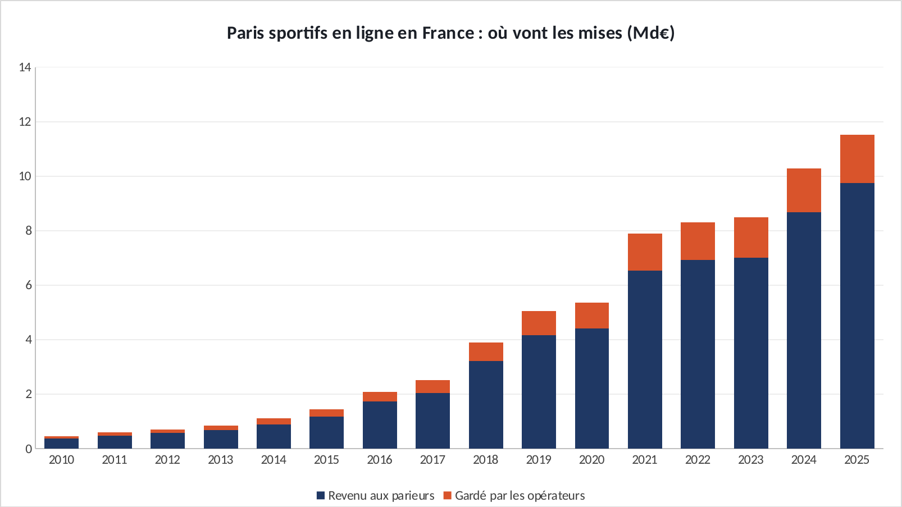
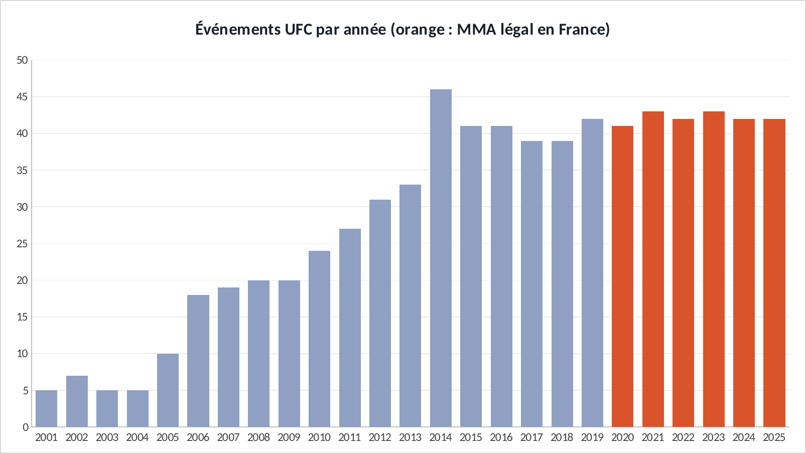
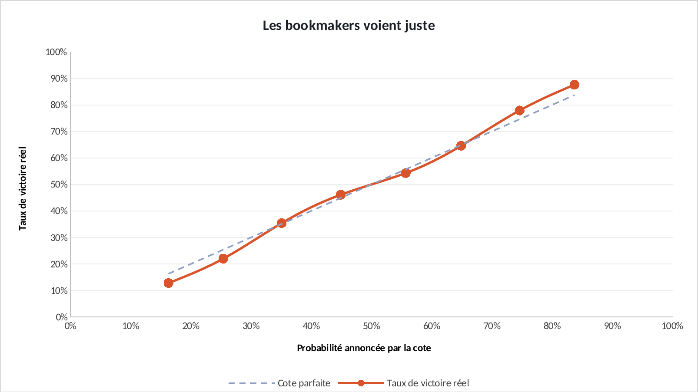
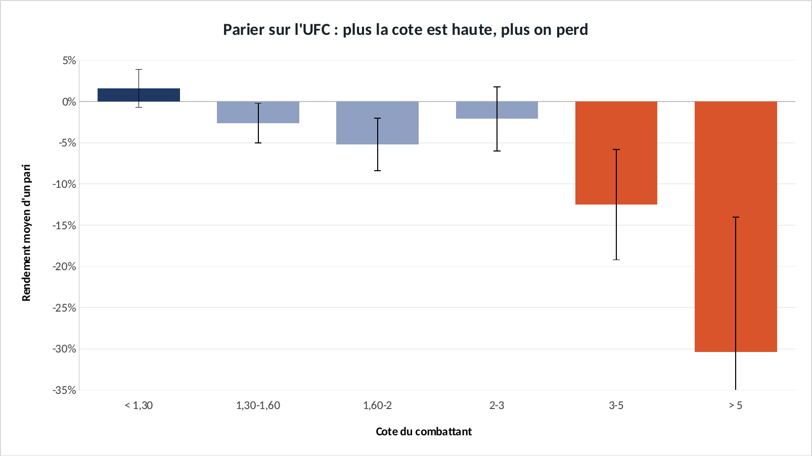
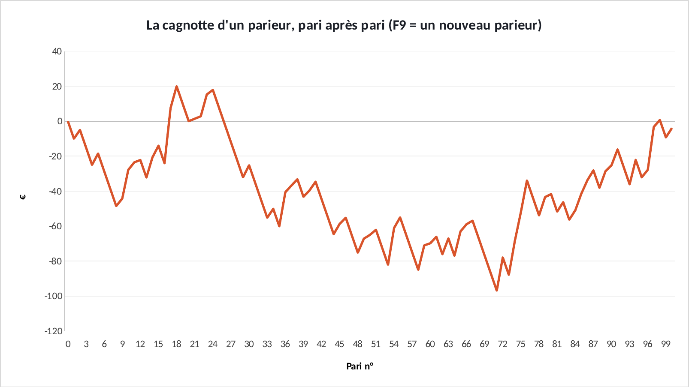

# Tuto — Le bookmaker gagne toujours. Même au MMA.

Refaire tous les graphiques de l'étude dans Excel, étape par étape. Durée : 1 h 30 environ.

**Les fichiers**

- [`excel/ufc-paris-exercice.xlsx`](excel/ufc-paris-exercice.xlsx) : les données, rien n'est fait. C'est celui-là qu'on remplit.
- [`excel/ufc-paris-corrige.xlsx`](excel/ufc-paris-corrige.xlsx) : la version finie, celle des graphiques du site.
- [`excel/csv/`](excel/csv) : les mêmes données en CSV, pour Power BI.
- [`excel/graphiques/`](excel/graphiques) : les graphiques exportés depuis le corrigé.

**Ce que vous allez pratiquer** : formules simples et recopie · SIERREUR, SOMME, COEFFICIENT.CORRELATION · histogramme empilé · colorier une seule barre · nuage de points avec une 2ᵉ série · barres d'erreur personnalisées · simulation avec ALEA.ENTRE.BORNES et INDEX · Power BI : import CSV.

## Avant de commencer

- Téléchargez le fichier **exercice** et ouvrez-le dans Excel. Les cellules **jaunes** sont à remplir, les graphiques sont à construire.
- Le fichier **corrigé** contient la version finie : c'est de là que viennent les graphiques du site. Ouvrez-le à côté pour comparer.
- Les formules sont écrites pour Excel en français : les arguments sont séparés par `;`. En anglais, remplacez `;` par `,` et utilisez le nom entre parenthèses.
- Recopier une formule vers le bas : sélectionnez la cellule, puis double-cliquez sur le petit carré en bas à droite.

> Les couleurs du portfolio : bleu `#1F3864`, orange `#D9542B`, gris `#8FA0C2`. Pour les appliquer : clic droit sur une série → **Mettre en forme une série de données** → pot de peinture **Remplissage et trait** → **Remplissage uni** → **Couleur** → **Autres couleurs** → onglet **Personnalisées** → champ **Hex**.

## Étape 1 — Où va l'argent des paris sportifs

*Onglet : Argent.* Calculer ce qui revient aux parieurs et ce que gardent les opérateurs, puis le montrer en histogramme empilé.

### 1.1 Revenu aux parieurs

- En **D5**, tapez la formule ci-dessous, puis recopiez-la jusqu'à **D20**.

| Cellule | Formule (Excel en français) | En anglais |
|---|---|---|
| D5 | `=B5-C5` | — |

### 1.2 Part gardée

- En **E5**, la part de chaque euro misé que gardent les opérateurs. SIERREUR évite une erreur si la mise vaut 0.
- Recopiez jusqu'à **E20**, et mettez la colonne au format **Pourcentage** (Accueil → Nombre → %).

| Cellule | Formule (Excel en français) | En anglais |
|---|---|---|
| E5 | `=SIERREUR(C5/B5;0)` | IFERROR |

### 1.3 En milliards, pour le graphique

- En **F5** et **G5**, divisez par 1 000. Recopiez jusqu'à la ligne 20.

| Cellule | Formule (Excel en français) | En anglais |
|---|---|---|
| F5 | `=D5/1000` | — |
| G5 | `=C5/1000` | — |

### 1.4 Les totaux et la corrélation

- Ligne 21 : les totaux. Recopiez la formule de B21 vers C21 et D21.
- En **E23**, la corrélation entre les mises et l'argent gardé.

| Cellule | Formule (Excel en français) | En anglais |
|---|---|---|
| B21 | `=SOMME(B5:B20)` | SUM |
| E21 | `=C21/B21` | — |
| E23 | `=COEFFICIENT.CORRELATION(B5:B20;C5:C20)` | CORREL |

### 1.5 Le graphique

- Sélectionnez **A4:A20**, puis maintenez **Ctrl** et sélectionnez **F4:G20**.
- **Insertion** → **Graphiques** → icône histogramme → **Histogramme empilé**.
- Couleurs : « Revenu » en bleu, « Gardé » en orange. Dans **Options des séries**, mettez **Largeur de l'intervalle** à 55 %.
- Cliquez sur le titre pour l'écrire. Bouton **+** à côté du graphique → **Légende** → **En bas**.

**✅ Vérifiez :** Total misé en B21 : **70 517** M€. Part gardée en E21 : **16,9 %**. Corrélation en E23 : **0,997**.

## Étape 2 — La popularité du MMA

*Onglet : Evenements.* Un histogramme simple, avec les années où le MMA est légal en France mises en avant.

### 2.1 Le graphique

- Sélectionnez **A4:B29** → **Insertion** → **Histogramme groupé**. Supprimez la légende (cliquez dessus, touche **Suppr**).
- Mettez toute la série en gris `#8FA0C2`.

### 2.2 Colorier une seule barre

- Cliquez une fois sur une barre : toute la série est sélectionnée. **Cliquez une deuxième fois** sur la barre 2020 : elle seule reste sélectionnée.
- Clic droit → **Mettre en forme le point de données** → orange `#D9542B`. Recommencez pour 2021 à 2025.

**✅ Vérifiez :** Les barres 2020 à 2025 sont orange, toutes autour de 42 événements par an.

## Étape 3 — Les bookmakers voient-ils juste ?

*Onglet : Calibration.* Comparer la probabilité annoncée par la cote au taux de victoire réel, avec une diagonale « cote parfaite ».

### 3.1 La diagonale

- En **D5**, recopiez simplement la probabilité annoncée. Recopiez jusqu'à **D12**.

| Cellule | Formule (Excel en français) | En anglais |
|---|---|---|
| D5 | `=A5` | — |

### 3.2 Le nuage de points

- Sélectionnez **A4:B12** → **Insertion** → **Nuage de points (X, Y)** → **Nuage de points avec lignes droites et marqueurs**.

### 3.3 Ajouter la diagonale

- Clic droit sur le graphique → **Sélectionner des données** → **Ajouter**.
- Nom : `Cote parfaite`. Valeurs X : **A5:A12**. Valeurs Y : **D5:D12**. OK.
- Mettez cette série en pointillés gris, sans marqueurs (**Remplissage et trait** → **Trait** → **Type de tiret**, puis **Marqueur** → **Aucun**).
- Clic droit sur chaque axe → **Mettre en forme l'axe** → Minimum 0, Maximum 1, Nombre au format **Pourcentage**.

**✅ Vérifiez :** Les points orange suivent la diagonale à quelques points près : les cotes sont justes.

## Étape 4 — Ce que rapporte 1 € misé

*Onglet : Rendement.* Un histogramme avec des valeurs négatives, des couleurs selon le résultat, et la marge d'erreur.

### 4.1 Le graphique

- Sélectionnez **A4:B10** → **Insertion** → **Histogramme groupé**. Supprimez la légende.
- Clic droit sur l'axe horizontal → **Mettre en forme l'axe** → **Étiquettes** → Position **Bas** : les noms de tranches passent sous le graphique.

### 4.2 Les couleurs

- Comme à l'étape 2.2 : barre « < 1,30 » en bleu, « 1,30-1,60 », « 1,60-2 » et « 2-3 » en gris, « 3-5 » et « > 5 » en orange.

### 4.3 Les barres d'erreur

- Bouton **+** → **Barres d'erreur** → **Autres options**.
- **Valeur d'erreur** → **Personnalisée** → **Spécifier une valeur**.
- Valeur positive : sélectionnez **C5:C10**. Valeur négative : sélectionnez **C5:C10** aussi.

**✅ Vérifiez :** La barre « > 5 » descend à **−30 %**. La barre « < 1,30 » est à +1,6 %, mais sa barre d'erreur passe sous zéro : le gain n'est pas sûr.

## Étape 5 — Le simulateur de parieur

*Onglet : Simulateur.* Simuler 100 paris sur de vrais combats tirés au hasard. Chaque appui sur F9 crée un nouveau parieur.

### 5.1 Tirer un combat au hasard

- L'onglet **Combats** contient 6 916 combats, des lignes 5 à 6920. En **B7** :

| Cellule | Formule (Excel en français) | En anglais |
|---|---|---|
| B7 | `=ALEA.ENTRE.BORNES(5;6920)` | RANDBETWEEN |

### 5.2 Choisir un camp

- Une chance sur deux pour chaque camp :

| Cellule | Formule (Excel en français) | En anglais |
|---|---|---|
| C7 | `=SI(ALEA()<0,5;"rouge";"bleu")` | IF, RAND |

### 5.3 Aller chercher la cote et le résultat

- INDEX va lire la cellule de la ligne tirée dans l'onglet Combats.

| Cellule | Formule (Excel en français) | En anglais |
|---|---|---|
| D7 | `=SI(C7="rouge";INDEX(Combats!A:A;B7);INDEX(Combats!B:B;B7))` | INDEX |
| E7 | `=SI(C7="rouge";INDEX(Combats!C:C;B7)=1;INDEX(Combats!C:C;B7)=0)` | — |

### 5.4 Le gain et la cagnotte

- Le `$` bloque la référence à la mise quand on recopie (touche **F4** pour l'ajouter).
- Recopiez **B7:H7** jusqu'à la ligne **106**, puis en **F4** affichez le bilan.

| Cellule | Formule (Excel en français) | En anglais |
|---|---|---|
| F7 | `=SI(E7;$C$4*(D7-1);-$C$4)` | — |
| H7 | `=H6+F7` | — |
| F4 | `=H106` | — |

### 5.5 La courbe

- Sélectionnez **H5:H106** → **Insertion** → **Courbes**. Couleur orange.
- Appuyez sur **F9** : tout est retiré au hasard, la courbe change. Comptez combien de fois vous finissez au-dessus de zéro.

**✅ Vérifiez :** Sur 10 appuis sur F9, vous devriez finir positif environ 3 fois. C'est le chiffre de l'étude : 31 % de gagnants.

## Exporter un graphique

- Cliquez sur le bord du graphique pour le sélectionner, puis clic droit → **Enregistrer en tant qu'image…** → format **PNG**.
- Pour une diapo : clic droit → **Copier**, puis **Collage spécial → Image** dans PowerPoint.

## La même chose dans Power BI

**Accueil** → **Obtenir des données** → **Texte/CSV** → choisissez le fichier → vérifiez que le délimiteur est **Point-virgule** → **Charger**.

| Fichier | Visuel | Champs |
|---|---|---|
| `argent.csv` | Histogramme empilé | Axe X : `annee` · Axe Y : `redistribue_meur` puis `garde_meur` |
| `evenements_ufc.csv` | Histogramme groupé | Axe X : `annee` · Axe Y : `evenements` |
| `calibration.csv` | Nuage de points | Axe X : `proba_annoncee` · Axe Y : `taux_victoire_reel` · Taille : `combattants` |
| `rendement_par_cote.csv` | Histogramme groupé | Axe X : `tranche_cote` · Axe Y : `rendement` (format %) |

Si les décimales s'affichent mal : **Transformer les données** → sélectionnez la colonne → **Type de données** → **Nombre décimal** → **Utilisation des paramètres régionaux** → Anglais (États-Unis).
